# 实验室预约与设备管理系统 - 架构图解

> 本文档使用 Mermaid 图表展示系统架构，与《系统架构设计文档》配套使用。

## 目录

1. [整体架构](#1-整体架构)
2. [技术栈](#2-技术栈)
3. [后端架构](#3-后端架构)
4. [前端架构](#4-前端架构)
5. [数据库架构](#5-数据库架构)
6. [API 架构](#6-api-架构)
7. [安全架构](#7-安全架构)
8. [业务流程](#8-业务流程)
9. [部署架构](#9-部署架构)

---

## 1. 整体架构

### 1.1 分层架构图

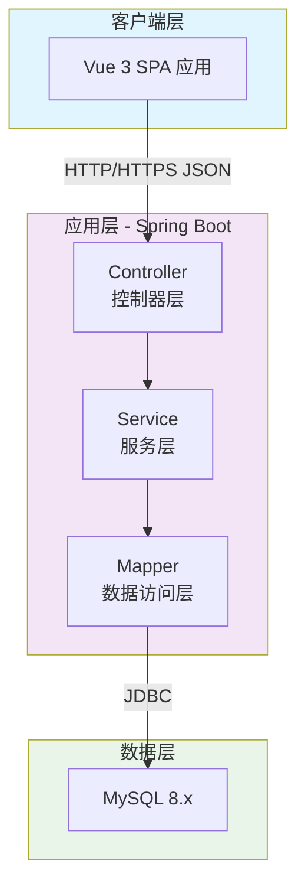

### 1.2 系统拓扑图

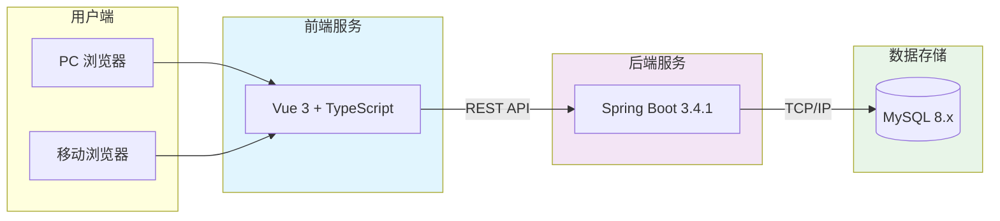

### 1.3 项目目录结构

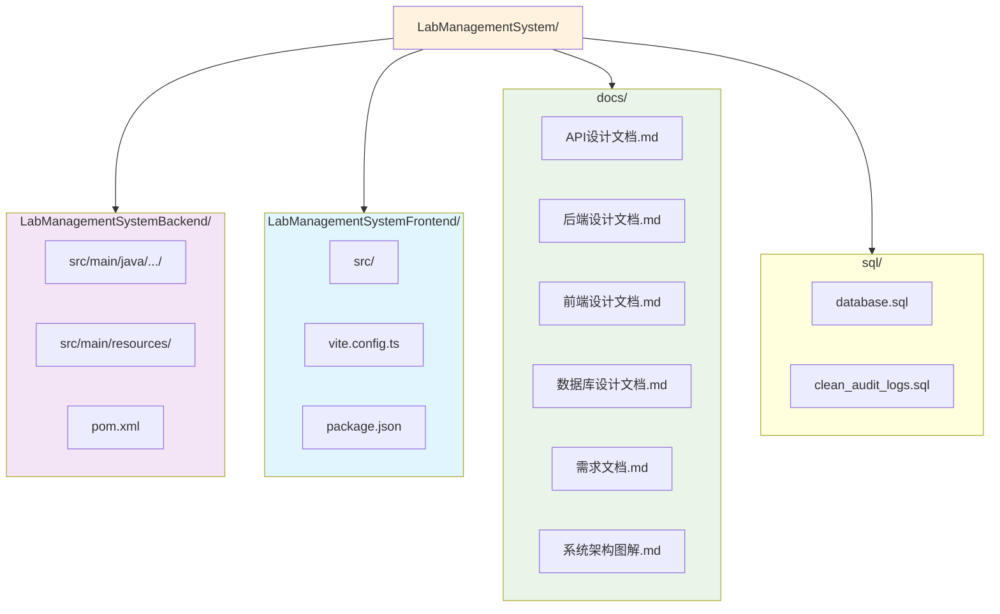

---

## 2. 技术栈

### 2.1 后端技术栈

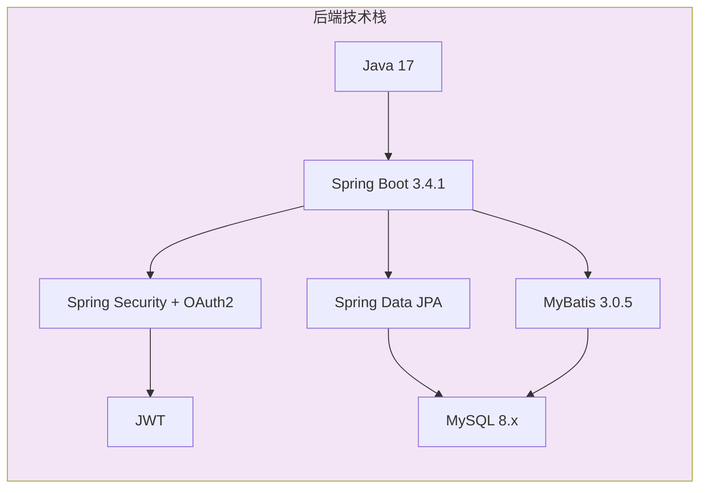

### 2.2 前端技术栈

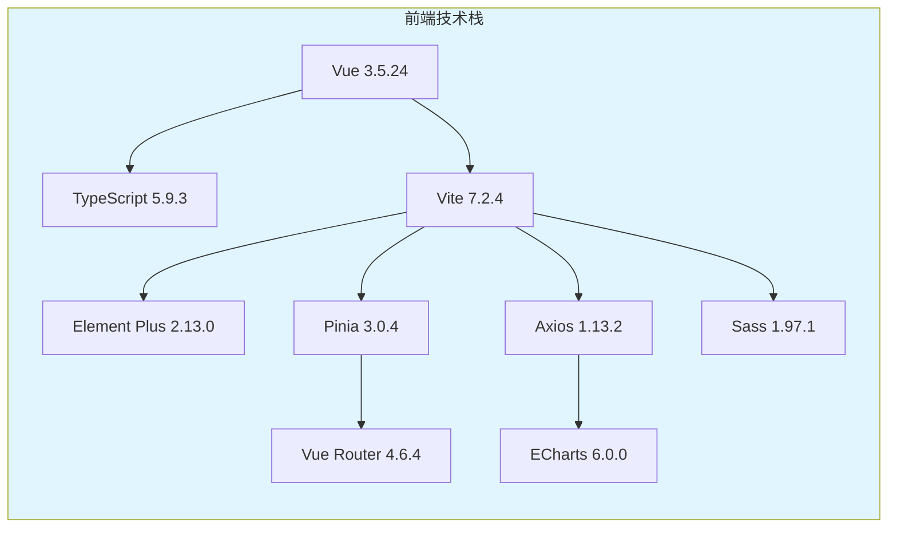

### 2.3 技术选型矩阵

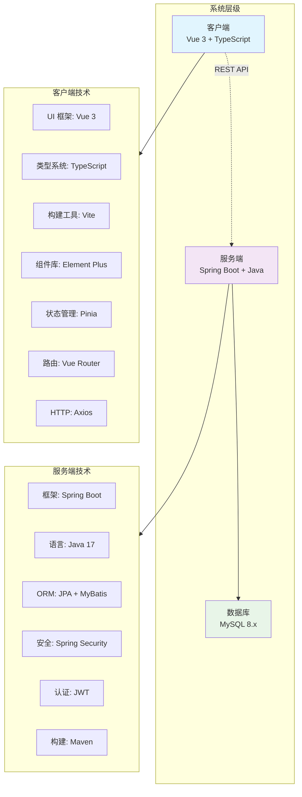

---

## 3. 后端架构

### 3.1 分层架构详解

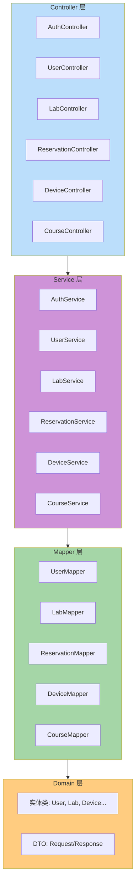

### 3.2 后端目录结构

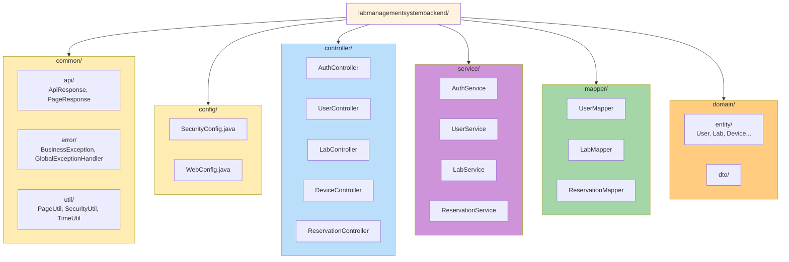

### 3.3 请求处理流程

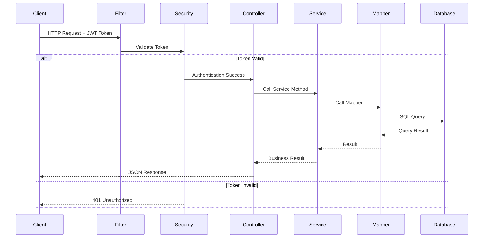

### 3.4 统一响应机制

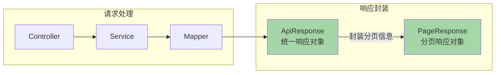

**ApiResponse 结构：**
```
┌─────────────────────────────────────┐
│         ApiResponse<T>              │
├─────────────────────────────────────┤
│  code: int          状态码          │
│  message: String    提示信息        │
│  data: T            响应数据        │
│  timestamp: long    时间戳          │
│  requestId: String  请求ID          │
└─────────────────────────────────────┘
```

**PageResponse 结构：**
```
┌─────────────────────────────────────┐
│         PageResponse<T>             │
├─────────────────────────────────────┤
│  items: List<T>    数据列表         │
│  total: long       总记录数         │
│  page: int         当前页码         │
│  pageSize: int     每页大小         │
│  totalPages: int   总页数           │
└─────────────────────────────────────┘
```

### 3.5 异常处理机制

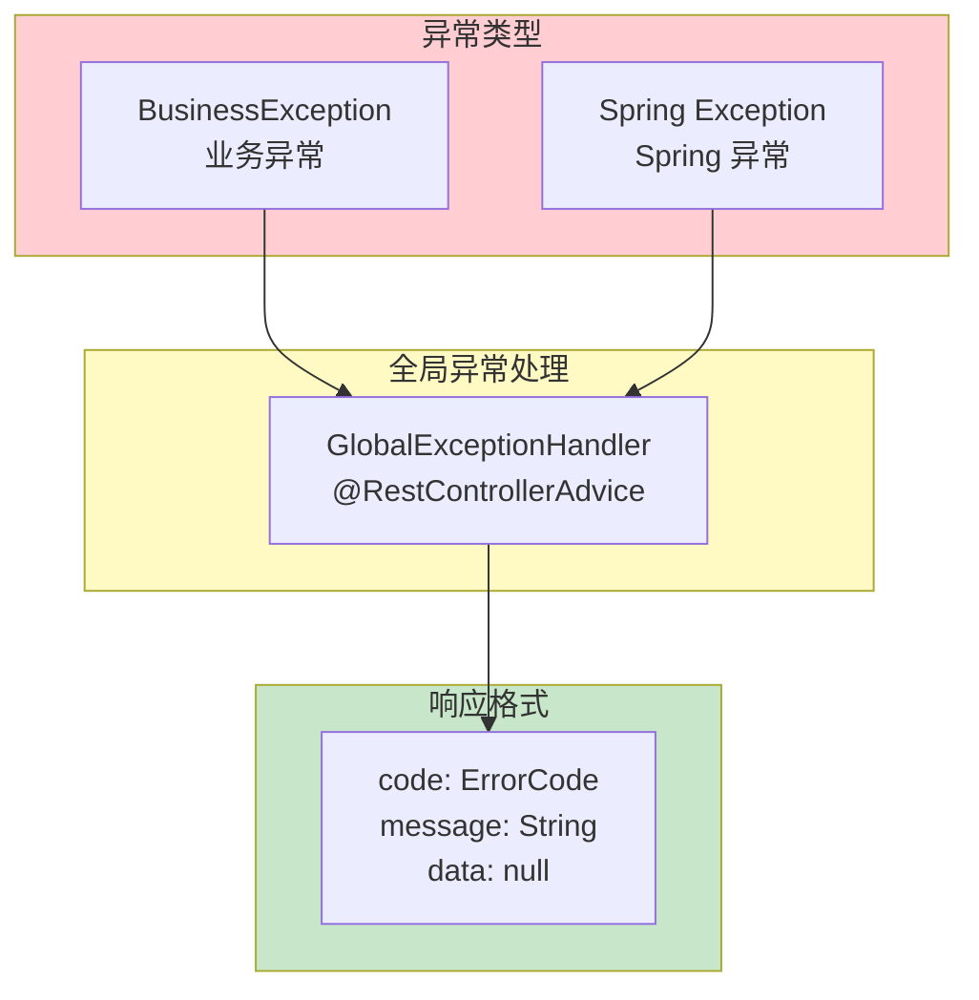

---

## 4. 前端架构

### 4.1 前端分层架构

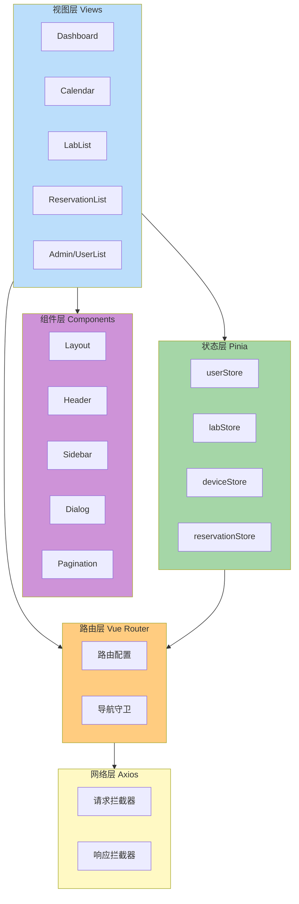

### 4.2 前端目录结构

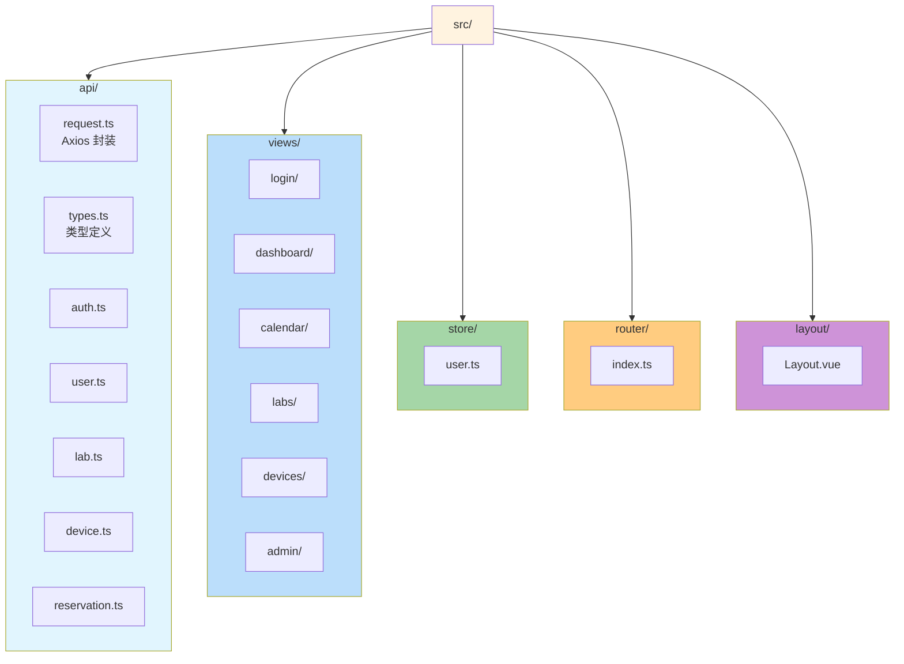

### 4.3 状态管理流程

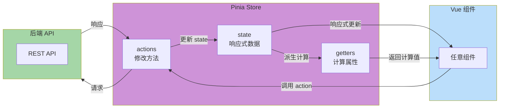

### 4.4 用户状态管理

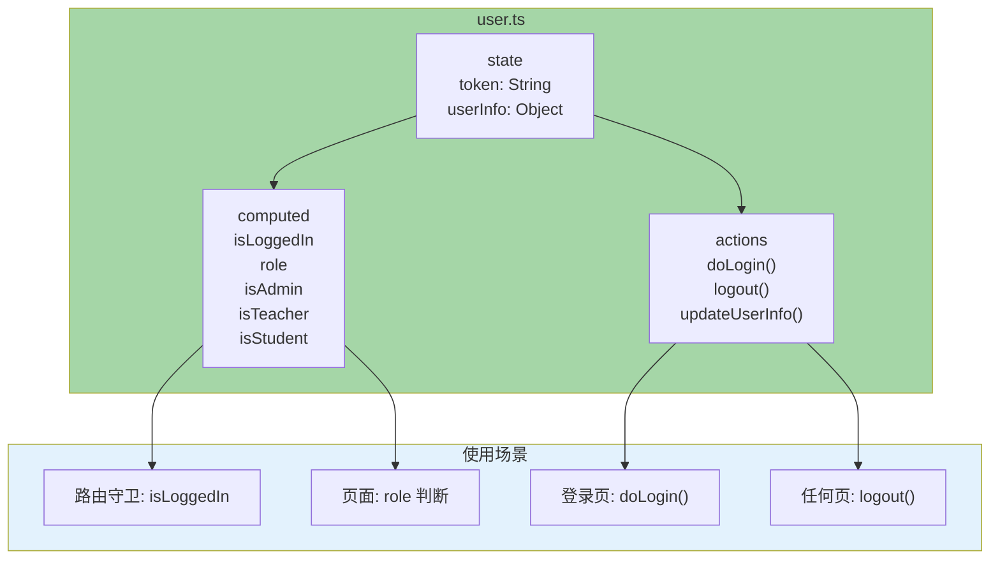

### 4.5 请求拦截流程

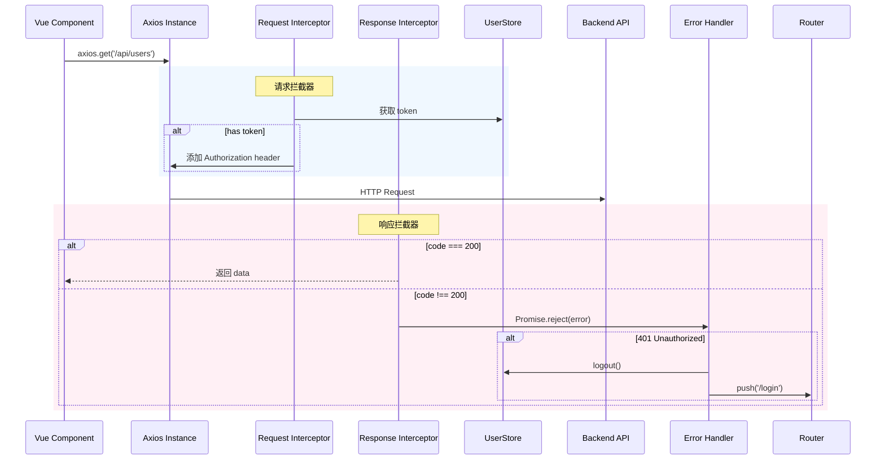

### 4.6 路由权限控制

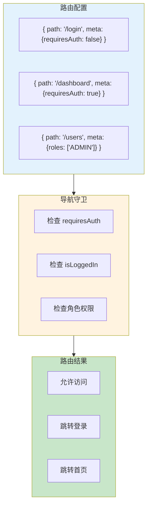

---

## 5. 数据库架构

### 5.1 数据库 ER 图

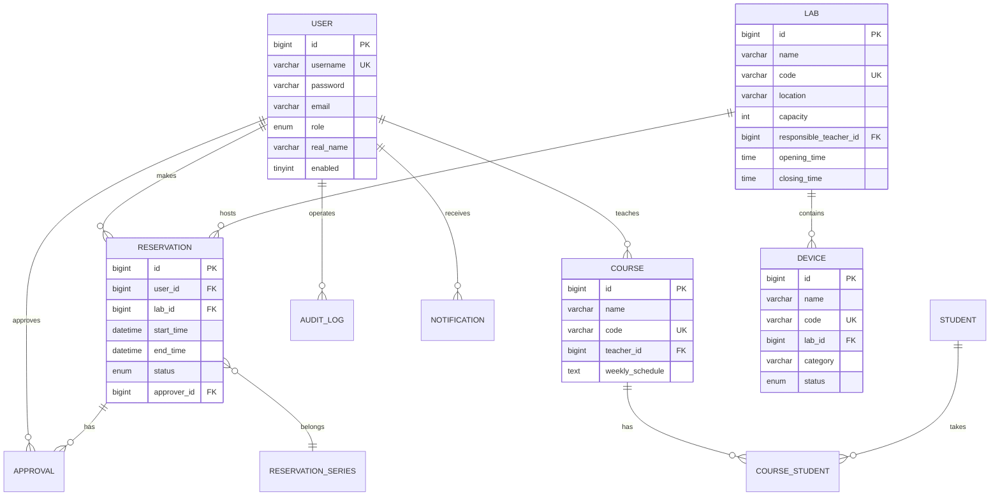

### 5.2 表关系图

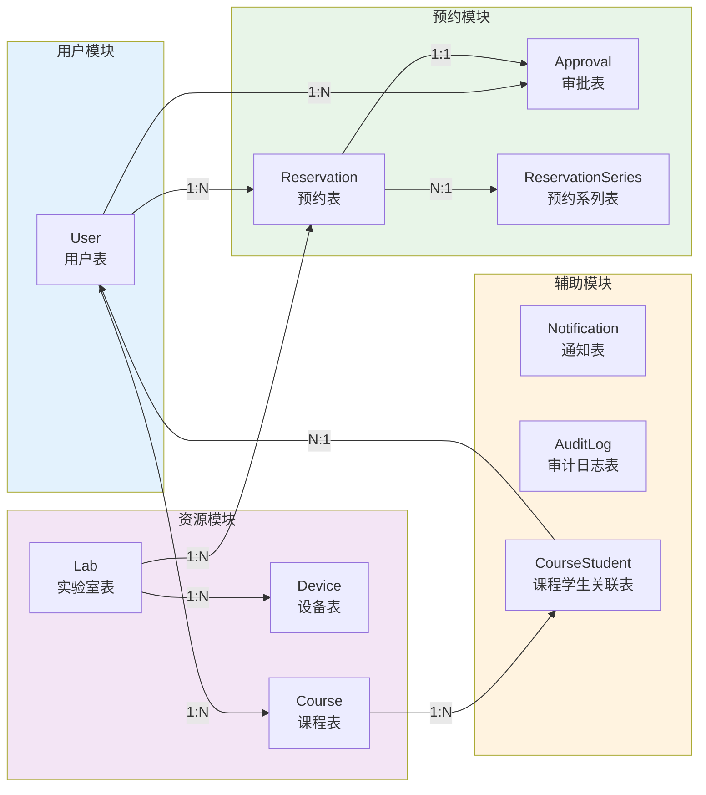

### 5.3 用户表结构

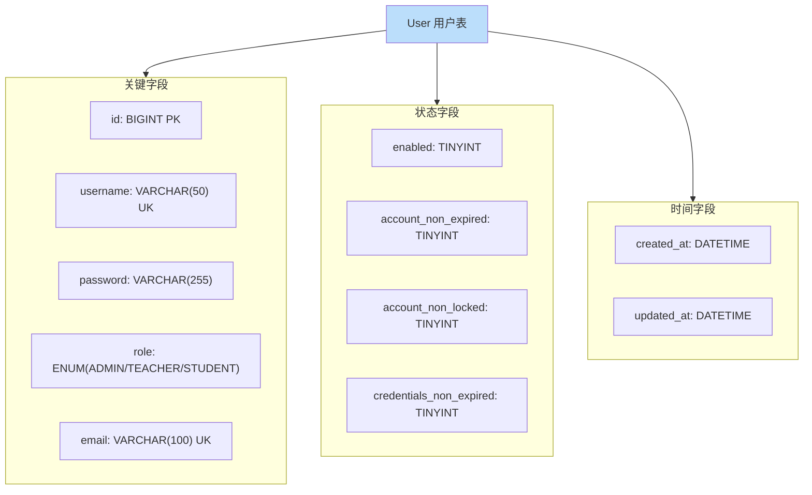

### 5.4 预约表结构

```mermaid
graph TD
    ReservationTable["Reservation 预约表"]

    subgraph CoreFields["核心字段"]
        ID["id: BIGINT PK"]
        UserID["user_id: BIGINT FK"]
        LabID["lab_id: BIGINT FK"]
        StartTime["start_time: DATETIME"]
        EndTime["end_time: DATETIME"]
    end

    subgraph StatusFields["状态字段"]
        Status["status: ENUM(PENDING/APPROVED/REJECTED/CANCELLED)"]
        Purpose["purpose: VARCHAR(200)"]
    end

    subgraph ApprovalFields["审批字段"]
        ApproverID["approver_id: BIGINT FK"]
        ApprovedAt["approved_at: DATETIME"]
        ApprovalComment["approval_comment: VARCHAR(500)"]
    end

    subgraph RelationFields["关联字段"]
        DeviceIDs["device_ids: TEXT(JSON)"]
        SeriesID["series_id: BIGINT FK"]
        CourseID["course_id: BIGINT FK"]
    end

    ReservationTable --> CoreFields
    ReservationTable --> StatusFields
    ReservationTable --> ApprovalFields
    ReservationTable --> RelationFields

    style ReservationTable fill:#c8e6c9
```

---

## 6. API 架构

### 6.1 API 模块划分

```mermaid
graph TB
    subgraph API["API 架构"]
        Auth["/api/auth<br/>认证模块"]
        User["/api/users<br/>用户模块"]
        Lab["/api/labs<br/>实验室模块"]
        Device["/api/devices<br/>设备模块"]
        Reservation["/api/reservations<br/>预约模块"]
        Course["/api/courses<br/>课程模块"]
        Calendar["/api/calendar<br/>日历模块"]
        Notification["/api/notifications<br/>通知模块"]
        Audit["/api/audit-logs<br/>审计模块"]
        Rule["/api/rule-config<br/>规则配置模块"]
    end

    style Auth fill:#ffcc80
    style User fill:#ce93d8
    style Lab fill:#a5d6a7
    style Device fill:#a5d6a7
    style Reservation fill:#bbdefb
    style Course fill:#bbdefb
    style Calendar fill:#fff9c4
    style Notification fill:#fff9c4
    style Audit fill:#ffcdd2
    style Rule fill:#ffcdd2
```

### 6.2 RESTful 资源映射

```mermaid
graph LR
    subgraph Resources["资源操作"]
        direction TB
        GET["GET /labs<br/>获取实验室列表"]
        POST["POST /labs<br/>创建实验室"]
        GET1["GET /labs/{id}<br/>获取实验室详情"]
        PUT["PUT /labs/{id}<br/>更新实验室"]
        DELETE["DELETE /labs/{id}<br/>删除实验室"]
    end

    subgraph HTTPMethods["HTTP 方法"]
        GETM["GET: 查询"]
        POSTM["POST: 创建"]
        PUTM["PUT: 更新"]
        DELETEM["DELETE: 删除"]
    end

    GETM --> GET
    GETM --> GET1
    POSTM --> POST
    PUTM --> PUT
    DELETEM --> DELETE

    style Resources fill:#e8f5e8
    style HTTPMethods fill:#fff3e0
```

### 6.3 API 响应格式

```mermaid
graph LR
    subgraph Type["响应类型"]
        Success["Success<br/>成功响应"]
        Page["Page<br/>分页响应"]
        Error["Error<br/>错误响应"]
    end

    Success -->|"code: 200"| Data1
    Page -->|"code: 200"| Data2
    Error -->|"code: !=200"| Data3

    Data1["返回业务数据"]
    Data2["返回分页数据"]
    Data3["返回错误信息"]

    style Success fill:#c8e6c9
    style Page fill:#c8e6c9
    style Error fill:#ffcdd2
```

**响应格式示例：**

**成功响应：**
```json
{
  "code": 200,
  "message": "操作成功",
  "data": { ... },
  "timestamp": 1704278400000,
  "requestId": "550e8400-e29b-41d4-a716-446655440000"
}
```

**分页响应：**
```json
{
  "code": 200,
  "message": "查询成功",
  "data": {
    "items": [...],
    "total": 100,
    "page": 1,
    "pageSize": 10,
    "totalPages": 10
  }
}
```

**错误响应：**
```json
{
  "code": 4001,
  "message": "预约时间冲突",
  "data": null,
  "timestamp": 1704278400000
}
```

### 6.4 认证流程

```mermaid
sequenceDiagram
    participant C as Client
    participant A as AuthController
    participant S as AuthService
    participant DB as Database
    participant J as JWT Service

    C->>A: POST /api/auth/login<br/>{username, password}
    A->>S: login(request)
    S->>DB: 验证用户
    alt 用户存在且密码正确
        DB-->>S: 用户信息
        S->>J: 生成 JWT Token
        J-->>S: token
        S-->>A: {token, user}
        A-->>C: {token, user}
    else 用户不存在或密码错误
        S-->>A: throw BusinessException
        A-->>C: 401 Unauthorized
    end

    Note over C: 后续请求携带 Token<br/>Authorization: Bearer <token>
```

---

## 7. 安全架构

### 7.1 JWT 认证流程

```mermaid
sequenceDiagram
    participant U as User
    participant C as Client
    participant A as Auth API
    participant J as JWT
    participant S as Spring Security
    participant DB as Database

    U->>C: 输入账号密码
    C->>A: POST /api/auth/login
    A->>DB: 验证凭据
    DB-->>A: 用户信息
    A->>J: 生成 JWT
    J-->>A: Token
    A-->>C: {token, userInfo}
    C->>C: 存储 localStorage

    Note over C: 后续请求
    C->>S: GET /api/resource<br/>Authorization: Bearer <token>

    rect rgb(240, 248, 255)
    Note over S: Token 验证
    S->>J: 解析并验证签名
    J-->>S: payload
    S->>DB: 查询用户权限
    DB-->>S: 权限信息
    end

    alt Token 有效
        S-->>C: 200 OK + Resource
    else Token 无效
        S-->>C: 401 Unauthorized
    end
```

### 7.2 JWT Token 结构

```mermaid
graph TB
    Token["JWT Token<br/>xxxxx.yyyyy.zzzzz"]

    subgraph Parts["Token 组成"]
        Header["Header<br/>头部"]
        Payload["Payload<br/>载荷"]
        Signature["Signature<br/>签名"]
    end

    Token --> Parts

    style Token fill:#fff3e0
    style Header fill:#bbdefb
    style Payload fill:#ce93d8
    style Signature fill:#a5d6a7
```

**Header（头部）：**
```json
{
  "alg": "HS256",
  "typ": "JWT"
}
```

**Payload（载荷）：**
```json
{
  "sub": "user_id",
  "username": "zhangsan",
  "role": "STUDENT",
  "iat": 1704278400,
  "exp": 1704282000
}
```

**Signature（签名）：**
```
HMAC-SHA256(secret, base64UrlEncode(header) + "." + base64UrlEncode(payload))
```

### 7.3 RBAC 权限模型

```mermaid
graph TB
    subgraph Users["用户"]
        Admin["管理员"]
        Teacher["教师"]
        Student["学生"]
    end

    subgraph Roles["角色"]
        AdminRole["ADMIN"]
        TeacherRole["TEACHER"]
        StudentRole["STUDENT"]
    end

    subgraph Permissions["权限"]
        P1["系统管理"]
        P2["实验室管理"]
        P3["设备管理"]
        P4["预约审批"]
        P5["预约申请"]
        P6["查看资源"]
    end

    Admin --> AdminRole
    Teacher --> TeacherRole
    Student --> StudentRole

    AdminRole --> P1
    AdminRole --> P2
    AdminRole --> P3
    AdminRole --> P4
    AdminRole --> P5
    AdminRole --> P6

    TeacherRole --> P2
    TeacherRole --> P4
    TeacherRole --> P5
    TeacherRole --> P6

    StudentRole --> P5
    StudentRole --> P6

    style Users fill:#e3f2fd
    style Roles fill:#fff3e0
    style Permissions fill:#e8f5e8
```

### 7.4 权限校验流程

```mermaid
graph TB
    subgraph Request["HTTP 请求"]
        Req["请求 + JWT Token"]
    end

    subgraph Validate["Token 验证"]
        V1["Token 存在检查"]
        V2["签名验证"]
        V3["过期时间检查"]
    end

    subgraph Auth["用户认证"]
        A1["解析用户信息"]
        A2["加载角色"]
    end

    subgraph Authorize["权限授权"]
        AU1["获取接口所需权限"]
        AU2["角色匹配检查"]
        AU3["资源归属检查"]
    end

    subgraph Result["处理结果"]
        Pass["允许访问"]
        Fail["403 Forbidden"]
    end

    Request --> Validate
    Validate --> Auth
    Auth --> Authorize
    Authorize --> Result

    style Request fill:#e3f2fd
    style Validate fill:#fff3e0
    style Auth fill:#f3e5f5
    style Authorize fill:#ce93d8
    style Result fill:#c8e6c9
```

### 7.5 安全防护措施

```mermaid
graph TB
    subgraph Security["安全机制"]
        Auth["JWT 认证<br/>无状态 Token"]
        Encrypt["密码加密<br/>BCrypt/Argon2"]
        HTTPS["HTTPS 加密传输"]
        CORS["CORS 跨域控制"]
        Validate["输入校验<br/>Spring Validation"]
        SQL["SQL 注入防护<br/>预编译语句"]
        XSS["XSS 防护<br/>前端转义"]
        Audit["审计日志<br/>操作记录"]
    end

    style Auth fill:#a5d6a7
    style Encrypt fill:#a5d6a7
    style HTTPS fill:#a5d6a7
    style CORS fill:#bbdefb
    style Validate fill:#bbdefb
    style SQL fill:#bbdefb
    style XSS fill:#ffcc80
    style Audit fill:#ffcc80
```

---

## 8. 业务流程

### 8.1 预约流程图

```mermaid
graph TD
    Start([开始]) --> SelectLab[选择实验室]
    SelectLab --> SelectTime[选择时间段]
    SelectTime --> CheckConflict{冲突检测}

    CheckConflict -->|有冲突| ShowError[显示冲突信息]
    ShowError --> SelectTime

    CheckConflict -->|无冲突| Submit[提交预约申请]

    Submit --> NeedApproval{需要审批?}

    NeedApproval -->|是| CreatePending[创建待审批预约]
    CreatePending --> SendNotify[发送审批通知]
    SendNotify --> WaitApproval[等待教师审批]
    WaitApproval --> TeacherApprove{教师审批}

    TeacherApprove -->|批准| ApproveSuccess[审批通过]
    TeacherApprove -->|拒绝| ApproveFail[审批拒绝]

    ApproveSuccess --> SendSuccessNotify[发送通过通知]
    ApproveFail --> SendFailNotify[发送拒绝通知]

    NeedApproval -->|否| AutoApprove[自动通过]

    AutoApprove --> SendSuccessNotify
    SendSuccessNotify --> End([预约成功])
    SendFailNotify --> End2([预约失败])
```

### 8.2 冲突检测算法

```mermaid
graph LR
    subgraph Input["输入参数"]
        I1["labId: 实验室ID"]
        I2["startTime: 开始时间"]
        I3["endTime: 结束时间"]
    end

    subgraph Process["检测流程"]
        P1["查询该实验室已有预约"]
        P2["过滤非取消状态"]
        P3["时间范围重叠检测"]
    end

    subgraph Result["检测结果"]
        R1["NONE: 无冲突"]
        R2["COMPLETE_OVERLAP: 完全重叠"]
        R3["PARTIAL_OVERLAP: 部分重叠"]
        R4["CONTAINMENT: 包含关系"]
    end

    Input --> Process
    Process --> Result

    style Input fill:#e3f2fd
    style Process fill:#fff3e0
    style Result fill:#c8e6c9
```

### 8.3 用户角色权限矩阵

```mermaid
graph TB
    subgraph Features["功能模块"]
        F1["查看实验室"]
        F2["查看设备"]
        F3["查看课程"]
        F4["提交预约"]
        F5["审批预约"]
        F6["管理实验室"]
        F7["管理设备"]
        F8["管理用户"]
        F9["系统配置"]
        F10["查看审计日志"]
    end

    subgraph Roles["角色权限"]
        A["ADMIN<br/>管理员"]
        T["TEACHER<br/>教师"]
        S["STUDENT<br/>学生"]
    end

    subgraph Legend["图例"]
        YES["Y: 有权限"]
        PART["P: 部分权限"]
        NO["N: 无权限"]
    end

    F1 -->|"Y"| A
    F1 -->|"Y"| T
    F1 -->|"Y"| S

    F2 -->|"Y"| A
    F2 -->|"Y"| T
    F2 -->|"Y"| S

    F3 -->|"Y"| A
    F3 -->|"Y"| T
    F3 -->|"Y"| S

    F4 -->|"Y"| A
    F4 -->|"Y"| T
    F4 -->|"Y"| S

    F5 -->|"Y"| A
    F5 -->|"Y"| T
    F5 -->|"N"| S

    F6 -->|"Y"| A
    F6 -->|"P"| T
    F6 -->|"N"| S

    F7 -->|"Y"| A
    F7 -->|"P"| T
    F7 -->|"N"| S

    F8 -->|"Y"| A
    F8 -->|"N"| T
    F8 -->|"N"| S

    F9 -->|"Y"| A
    F9 -->|"N"| T
    F9 -->|"N"| S

    F10 -->|"Y"| A
    F10 -->|"N"| T
    F10 -->|"N"| S

    style YES fill:#c8e6c9
    style PART fill:#fff9c4
    style NO fill:#ffcdd2
```

**权限矩阵表：**

| 功能 | ADMIN | TEACHER | STUDENT |
|------|-------|---------|---------|
| 查看实验室 | Y | Y | Y |
| 查看设备 | Y | Y | Y |
| 查看课程 | Y | Y | Y |
| 提交预约 | Y | Y | Y |
| 审批预约 | Y | Y | N |
| 管理实验室 | Y | P(部分) | N |
| 管理设备 | Y | P(部分) | N |
| 管理用户 | Y | N | N |
| 系统配置 | Y | N | N |
| 查看审计日志 | Y | N | N |

**说明：**
- Y = 有权限
- P = 部分权限（仅限负责的实验室）
- N = 无权限

### 8.4 通知流程

```mermaid
sequenceDiagram
    participant R as Reservation
    participant N as NotificationService
    participant DB as Database
    participant U as User

    R->>N: 状态变更事件
    N->>DB: 创建通知记录
    DB-->>N: 保存成功
    N->>U: 推送 WebSocket 通知
    U->>U: 前端弹出提示

    Note over U: 用户查看通知
    U->>DB: 获取通知列表
    DB-->>U: 通知数据
    U->>DB: 标记已读
    DB-->>U: 更新成功
```

---

## 9. 部署架构

### 9.1 生产环境架构

```mermaid
graph TB
    subgraph Internet["互联网"]
        User1["用户 1"]
        User2["用户 2"]
        User3["用户 3"]
    end

    subgraph Network["网络层"]
        DNS["DNS"]
        LB["Load Balancer<br/>Nginx/HAProxy"]
        SSL["SSL Certificate"]
    end

    subgraph Frontend["前端服务"]
        Nginx["Nginx<br/>静态资源"]
    end

    subgraph Backend["后端集群"]
        BE1["Spring Boot<br/>Node 1"]
        BE2["Spring Boot<br/>Node 2"]
        BE3["Spring Boot<br/>Node 3"]
    end

    subgraph Storage["数据存储"]
        MySQL["MySQL 8.x<br/>Primary + Replica"]
    end

    User1 --> DNS
    User2 --> DNS
    User3 --> DNS
    DNS --> LB
    LB --> SSL
    LB --> Nginx
    Nginx --> BE1
    Nginx --> BE2
    Nginx --> BE3
    BE1 --> MySQL
    BE2 --> MySQL
    BE3 --> MySQL

    style Internet fill:#e3f2fd
    style Network fill:#fff3e0
    style Frontend fill:#ce93d8
    style Backend fill:#bbdefb
    style Storage fill:#a5d6a7
```

### 9.2 开发环境架构

```mermaid
graph LR
    subgraph Dev["开发环境"]
        Browser["浏览器<br/>localhost:5173"]
        Vite["Vite Dev Server"]
        Backend["Spring Boot<br/>localhost:8080"]
        MySQL["MySQL<br/>localhost:3306"]
    end

    Browser --"5173"--> Vite
    Vite --"/api 代理"--> Backend
    Backend --"3306"--> MySQL

    style Dev fill:#f5f5f5
```

### 9.3 Docker 部署架构

```mermaid
graph TB
    subgraph DockerHost["Docker Host"]
        subgraph Compose["docker-compose"]
            FrontendSvc["frontend<br/>Vue 构建镜像"]
            BackendSvc["backend<br/>Spring Boot 镜像"]
            MySQLsvc["mysql<br/>MySQL 8.x"]
            NginxSvc["nginx<br/>反向代理"]
        end
    end

    subgraph External["外部服务"]
        Users["用户浏览器"]
    end

    Users --> FrontendSvc
    FrontendSvc --> NginxSvc
    NginxSvc --> BackendSvc
    BackendSvc --> MySQLsvc

    style DockerHost fill:#e8f5e8
    style External fill:#e3f2fd
```

### 9.4 部署流程

```mermaid
graph LR
    subgraph Build["构建阶段"]
        B1["前端: npm run build"]
        B2["后端: mvn package"]
    end

    subgraph Docker["Docker 阶段"]
        D1["前端镜像: docker build"]
        D2["后端镜像: docker build"]
    end

    subgraph Deploy["部署阶段"]
        D3["docker-compose up -d"]
        D4["健康检查"]
    end

    B1 --> D1
    B2 --> D2
    D1 --> D3
    D2 --> D3
    D3 --> D4

    style Build fill:#e3f2fd
    style Docker fill:#fff3e0
    style Deploy fill:#c8e6c9
```

---

## 附录

### A. 架构图索引

| 编号 | 图名称 | 类型 | 用途 |
|------|--------|------|------|
| 1.1 | 分层架构图 | Flowchart | 展示系统分层 |
| 1.2 | 系统拓扑图 | Flowchart | 展示系统组件关系 |
| 1.3 | 项目目录结构 | Flowchart | 展示目录组织 |
| 2.1 | 后端技术栈 | Flowchart | 后端技术选型 |
| 2.2 | 前端技术栈 | Flowchart | 前端技术选型 |
| 3.1 | 后端分层架构 | Flowchart | 后端分层详解 |
| 3.2 | 后端目录结构 | Flowchart | 后端代码组织 |
| 3.3 | 请求处理时序 | SequenceDiagram | 请求处理流程 |
| 4.1 | 前端分层架构 | Flowchart | 前端分层详解 |
| 4.2 | 前端目录结构 | Flowchart | 前端代码组织 |
| 5.1 | 数据库 ER 图 | ER | 数据库关系 |
| 5.2 | 表关系图 | Flowchart | 数据表关联 |
| 6.1 | API 模块划分 | Flowchart | API 组织 |
| 6.2 | RESTful 资源映射 | Flowchart | RESTful 设计 |
| 7.1 | JWT 认证时序 | SequenceDiagram | JWT 认证流程 |
| 8.1 | 预约流程图 | Flowchart | 核心业务流程 |
| 9.1 | 生产环境架构 | Flowchart | 部署架构 |

### B. Mermaid 支持

本文档使用 Mermaid 语法编写，支持在以下平台查看：

- **VS Code**: 安装 "Markdown Preview Mermaid Support" 扩展
- **Typora**: 直接支持 Mermaid 渲染
- **GitHub**: 原生支持 Mermaid
- **Notion**: 支持 Mermaid
- **Mermaid Live Editor**: https://mermaid.live/

---

*本文档与《系统架构设计文档》配套使用*
*最后更新：2025-01-03*
